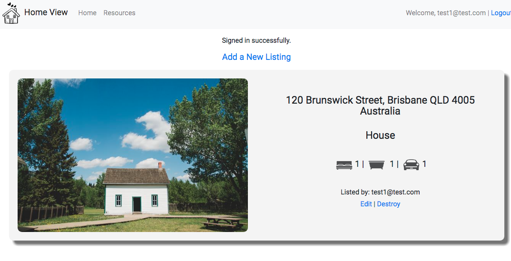
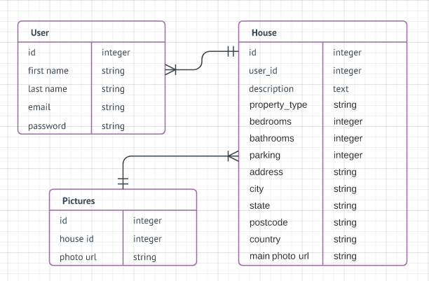
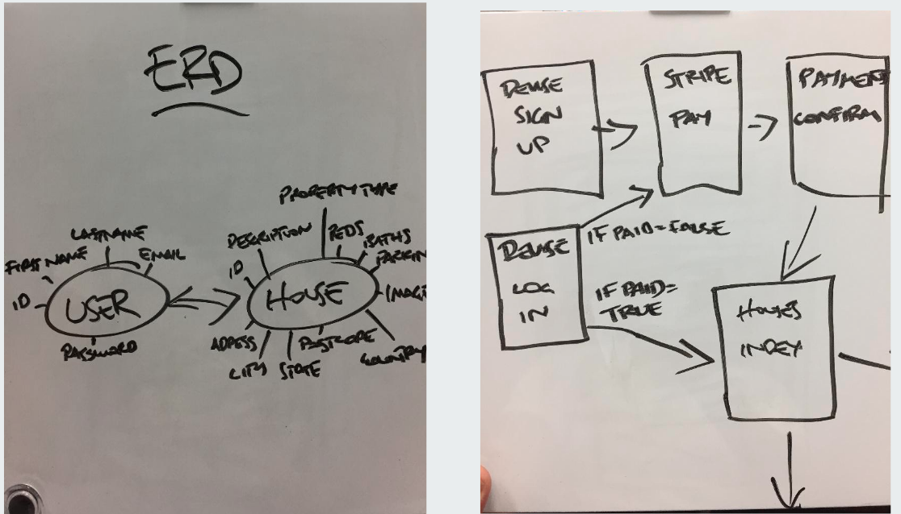
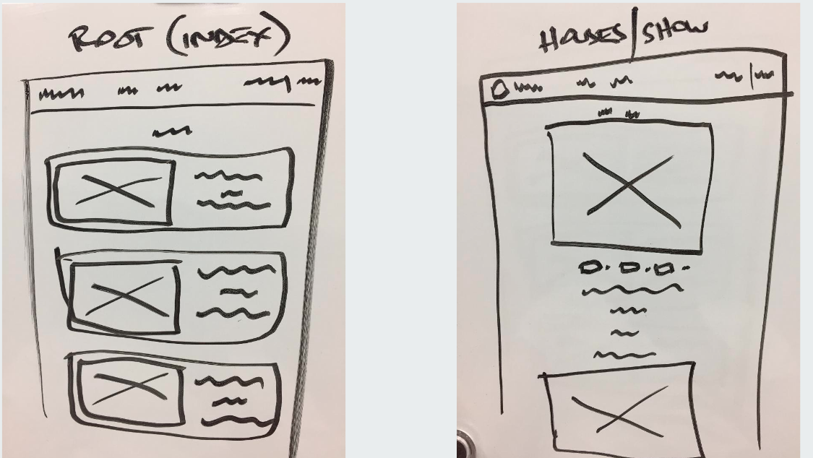

# README
Deployed on heroku:(https://home-view.herokuapp.com)

This app was designed in 1 1/2 days as part of a Hackathon.

It is a design of a real estate app that matches a buyers needs to HomeView.

It then matches the user’s wish list  with homes for sale in the database.

* Gems used Devise, Paperclip, pg (Postgres), Stripe, Mailgun, DotEnv and Punching Bag

* Configuration - you will not have an ENV file as this has been ignored through Git. In order to run the App you will need to create a .env file with your own mailgun and stripe API keys .
MAILGUN_API_KEY=
MAILGUN_DOMAIN=
STRIPE_PUBLISHABLE_KEY=
STRIPE_SECRET_KEY=

